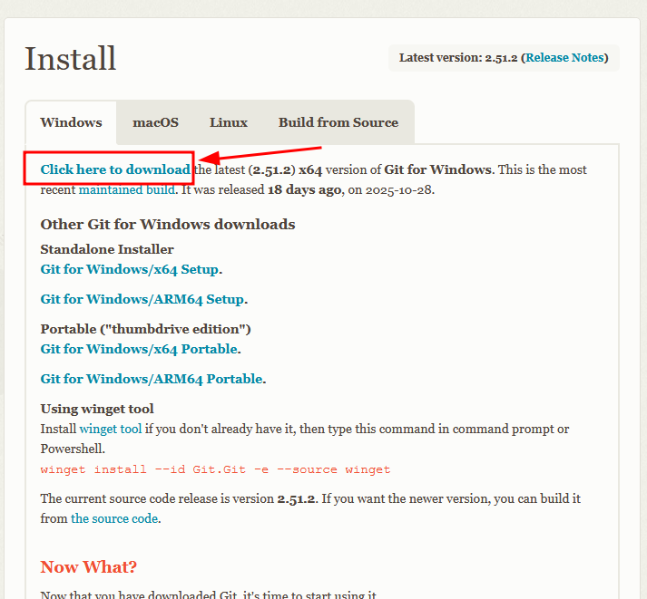
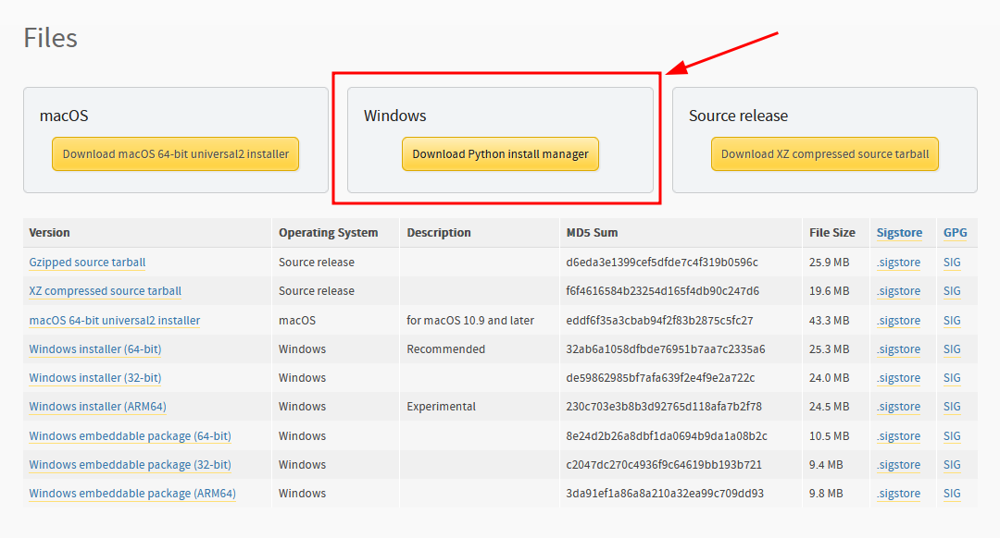
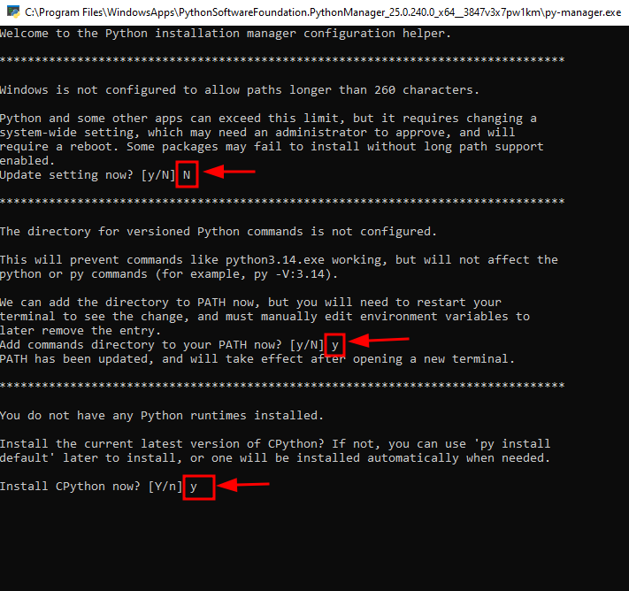
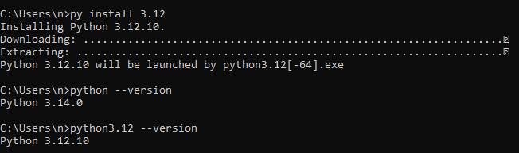

# Installing System Dependencies

Your computer must have some minimal software packages installed before the
SmartBots can be used. Linux and windows are both supported.

:::{note}
A mainstream Linux distro is
preferred since windows will require more troubleshooting and is generally difficult to work with.
:::

```{contents} Table of Contents
:depth: 3
```

## Linux

The following packages are needed:

- [Git](https://git-scm.com/install/windows)
- [Python3.12](https://www.python.org/downloads/release/python-31210/)
- [VSCode](https://code.visualstudio.com/download)

For **Debian based** distributions (Ubuntu/Mint/etc) these can be installed by
running the following command in a shell:

```bash
sudo apt update && sudo apt install git python
```

For **Arch based** distributions (Arch/PopOS/Manjaro/etc) these can be installed by
running the following command in a shell:

```bash
sudo pacman -Sy git python code
```

### Check that python was installed correctly

Check that python is installed, runnable, and the correct version by running the
following in a shell:

```bash
python --version
```

which should report `Python 3.12.10`.

## Windows

The following packages are needed:

- [Git](https://git-scm.com/install/windows) (will install "Git" as well as "Git Bash".)
- [Python3.12 (Via Python Install Manager)](https://www.python.org/downloads/release/pymanager-250/)
- [VSCode](https://code.visualstudio.com/download)

### Git install for windows:

Download and install Git for windows.



See the following gif for details if you are confused.

<div style="max-width: 100%; overflow-x: auto;">
  <video controls style="width: 100%; height: auto;" poster="../_static/gifs/demo_preview.gif">
    <source src="../_static/videos/gitbash_install.webm" type="video/webm">
  </video>
</div>
<br>

### Python install for windows:

- Download **Python Install Manager**. This will install Python3.14 automatically
- Choose 'y' when prompted to add commands directory to your PATH
- Chose 'y' when prompted to install the CPython runtime
- Run `py install 3.12` in a shell
- Check that 1python3.121 was installed





Then install **python3.12** using the Python Install Manager by running the following command in a command prompt shell (CMD).

```bash
py install 3.12
```


See the following gif for details if you are confused.

<div class="video-card">
  <video controls style="width: 100%; height: auto;" poster="../_static/gifs/demo_preview.gif">
    <source src="../_static/videos/win_py_install.webm" type="video/webm">
  </video>
</div>

Check that python3.12 was installed correctly by running the following in a shell:

```bash
python3.12 --version
# Python 3.12.10
```

which should report `Python 3.12.10`.

<br>

### VSCode install for windows:

Install like you would any program. If you are confused see the following gif for details.

<div style="max-width: 100%; overflow-x: auto;">
  <video controls style="width: 100%; height: auto;" poster="../_static/gifs/demo_preview.gif">
    <source src="../_static/videos/win_vs_install.webm" type="video/webm">
  </video>
</div>
