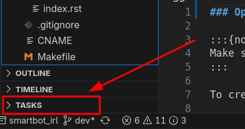
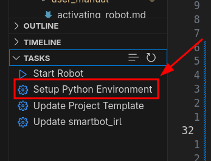

# Setup Python Virtual Environment (venv)

```{contents} Table of Contents
:depth: 3
```

Before we can can use the `smartbot_irl` package to send and receive data from
the SmartBot we must make it importable for our python code.

We will use a python [virtual environment](https://peps.python.org/pep-0405/) in
our project so that we can more easily manage python dependencies. There are two
options for creating and manage venvs: Shell commands and VSCodes built in
tools. Both are shown here.

:::{note}
Windows makes using python and venvs more cumbersome. Instructions
found online will be primarily aimed at Linux and may not work for windows.
:::

## Linux Virtual Environment

TODO

## Windows Virtual Environment

### Option 1: Setting up a venv using VSCode Tasks
If the "fast-tasks" extension is installed then a small section will appear in
the bottom "Explorer" pane. The buttons in this section will automate the
process of creating the venv and installing packages.







### Option 2: Setting up a venv using the shell

:::{note}
Make sure to run the following commands from inside the top level of the `smartbot3_project_template` you cloned!
:::

To create a python3.12 venv in a directory named `.venv` use the command:

```bash
python3.12 -m venv .venv
```

<div class="video-card">
  <video controls style="width: 100%; height: auto;" poster="../_static/gifs/demo_preview.gif">
    <source src="../_static/videos/win_venv_install.webm" type="video/webm">
  </video>
</div>

Then install the `smartbot_irl` package and all dependencies using:

```bash
.venv/Scripts/pip.exe install -e smartbot_irl
```

<div class="video-card">
  <video controls style="width: 100%; height: auto;" poster="../_static/gifs/demo_preview.gif">
    <source src="../_static/videos/win_venv_smartbot_install.webm" type="video/webm">
  </video>
</div>

