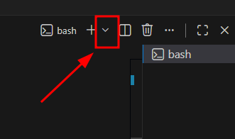
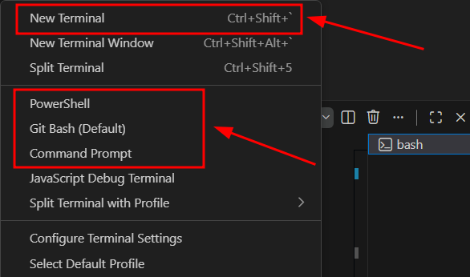

# Setting Up Your Workspace
This document will help you setup your personal computer to control the SmartBots

```{contents} Table of Contents
:depth: 3
```

## Clone the repo using git

Clone this repo with the following command (note the --recursive flag!):

```bash
git clone --recursive https://github.com/wvu-irl/smartbot3_project_template
```

This repo includes _another repo_ `smartbot_irl` which is a python package used to control the IRL SmartBot.
See the following gif for details if you are confused.
<div class="video-card">
  <video controls style="width: 100%; height: auto;" poster="../_static/gifs/demo_preview.gif">
    <source src="../_static/videos/win_clone_repo.webm" type="video/webm">
  </video>
</div>

## Open the `smartbot3_project_template` folder in VSCode

Now, let's open VSCode to the directory for the reop we have just cloned. **When prompted to install recommended extensions, click yes**. See the following gif for details if you are confused.
<div class="video-card">
  <video controls style="width: 100%; height: auto;" poster="../_static/gifs/demo_preview.gif">
    <source src="../_static/videos/win_vsc_extensions_open.webm" type="video/webm">
  </video>
</div>


## Install workspace recommended extensions

If the prompt to install recommended extensions did not appear or if you want to check for newly added recommended extensions you can search for `@recommended` in the "Extensions" menu. To download all recommended extensions click the small download button under the search bar.


## Open a VSCode terminal (shell)

This can be done by going to the menu `View->Terminal`. Alternatively the keymap `` Ctrl-`  `` will toggle the terminal pane open/closed.

We can have VSC open a variety of shells. On windows we can select from gitbash, CMD, and powershell. You may do this by clicking on the small down arrow at the top of the terminal pane.


We can make additional terminal windows here if desired. Alternatively, the keymap `` Ctrl-Shift-`  `` will also do this.



